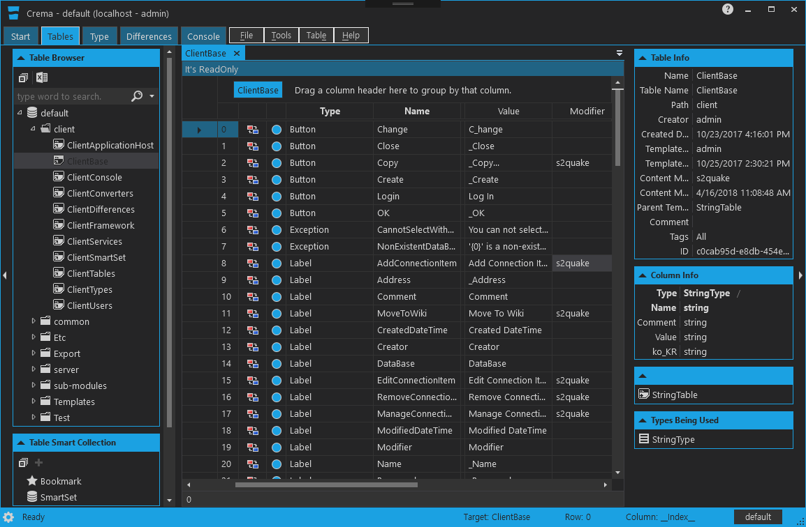

# Crema
크레마는 게임 개발에 필요한 데이터를 만들고 편리하게 사용하기 위한 솔루션입니다. 
게임 디자이너에게는 데이터를 생성 및 관리를 할 수 있게 UI를 제공하며
게임 프로그래머에게는 데이터를 쉽게 사용할 수 있게 코드와 바이너리 데이터를 생성할 수 있는 기능이 제공됩니다.

## 주요 특징
### 게임 디자이너
* 동시 편집
* 엑셀 파일 내보내기(export) 및 가져오기(import)
* 데이터 버전 관리 및 복구
* 데이터 비교 및 병합
### 게임 프로그래머
* 코드 및 바이너리 데이터 생성
   * c#, typescript, c++
* 쉽고 빠른 데이터 로딩
* 키 값을 통한 쉬운 데이터를 열람
### 기타
* javascript 언어를 사용한 자동화 작업
* 다양한 형태의 내보내기 지원(미포함)
   * excel, xml, json, yaml, mssql, mysql, sqlite
* Window Service 지원
* mac osx에서 사용가능
   * 터미널 기반 프로그램 한정

## 프로그램 구성
### cremaserve
콘솔 기반 크레마 서버 구동 프로그램

    실행 예시
    C:\Crema>cremaserve.exe run repo-path
### crema
UI 기반 크레마 클라이언트 프로그램

### cremaconsole
콘솔 기반 크레마 클라이언트 프로그램

    실행 예시
    C:\Crema>cremaconsole.exe connect localhost
    C:\Crema>cremaconsole.exe run javascript.js
### cremadev
콘솔 기반 크레마 코드 및 바이너리 데이터 생성 프로그램

    실행 예시
    C:\Crema>cremadev.exe get localhost outputPath
    C:\Crema>cremadev.exe get localhost outputPath --lang ts

### cremadevapp
UI 기반 크레마 코드 및 바이너리 데이터 생성 프로그램

## Development Environment
* Microsoft Visual Studio Professional 2017
* C# 7.0
* .NET Framework 4.5
* WPF(Windows Presentation Foundation)
* WCF(Windows Communication Foundation)

## 실행 필수 요소
* [svn](https://tortoisesvn.net/)
    * 미설치시 cremaserve 구동 불가능

## 빌드시 필요 라이선스
* [Xceed DataGrid for WPF v5.7](https://xceed.com/product/xceed-datagrid-for-wpf/)
    * 라이선스 없을시에 crema 실행 불가능
* [Xceed Toolkit Plus for WPF](https://xceed.com/xceed-toolkit-plus-for-wpf/)
    * 라이선스 없을시에 crema, cremadev 빌드후 실행 불가능
* [Newtonsoft.Json.Schema](https://www.newtonsoft.com/jsonschema)
    * cremaserve 구동후 일부 기능 사용횟수 제한(자주 사용되지 않는 기능)

## Libraries
* [Caliburn.Micro](https://caliburnmicro.com/)
* [ClosedXML](https://github.com/ClosedXML/ClosedXML)
* [DocumentFormat.OpenXml](https://github.com/OfficeDev/Open-XML-SDK)
* [jint](https://github.com/sebastienros/jint)
* [log4net](http://logging.apache.org/log4net/)
* [ModernUI.WPF](https://github.com/firstfloorsoftware/mui)
* [MahApps.Metro](https://github.com/MahApps/MahApps.Metro)
* [Newtonsoft.Json](https://www.newtonsoft.com/json)
* [Newtonsoft.Json.Schema](https://www.newtonsoft.com/jsonschema)
* [WindowsAPICodePack-Shell](https://github.com/aybe/Windows-API-Code-Pack-1.1)
* [YamlDotNet](https://github.com/aaubry/YamlDotNet/wiki)
* [Xceed DataGrid for WPF v5.7](https://xceed.com/product/xceed-datagrid-for-wpf/)
* [Xceed Toolkit Plus for WPF](https://xceed.com/xceed-toolkit-plus-for-wpf/)
* [diffplex](https://github.com/mmanela/diffplex)
